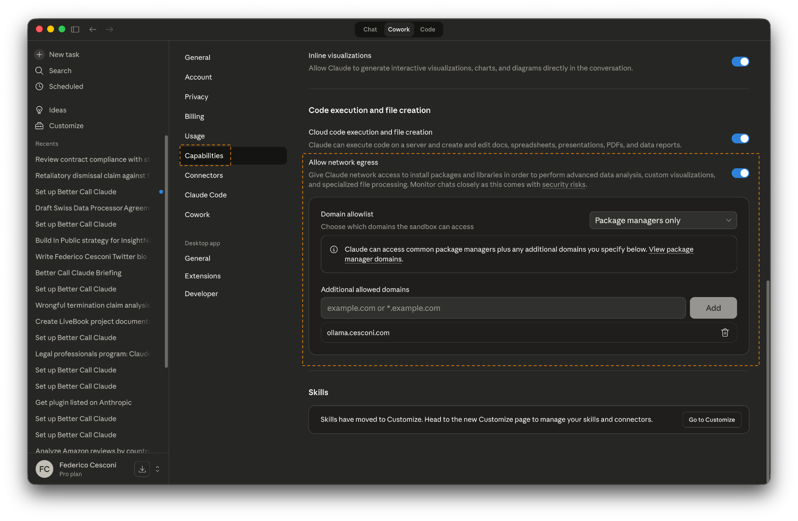
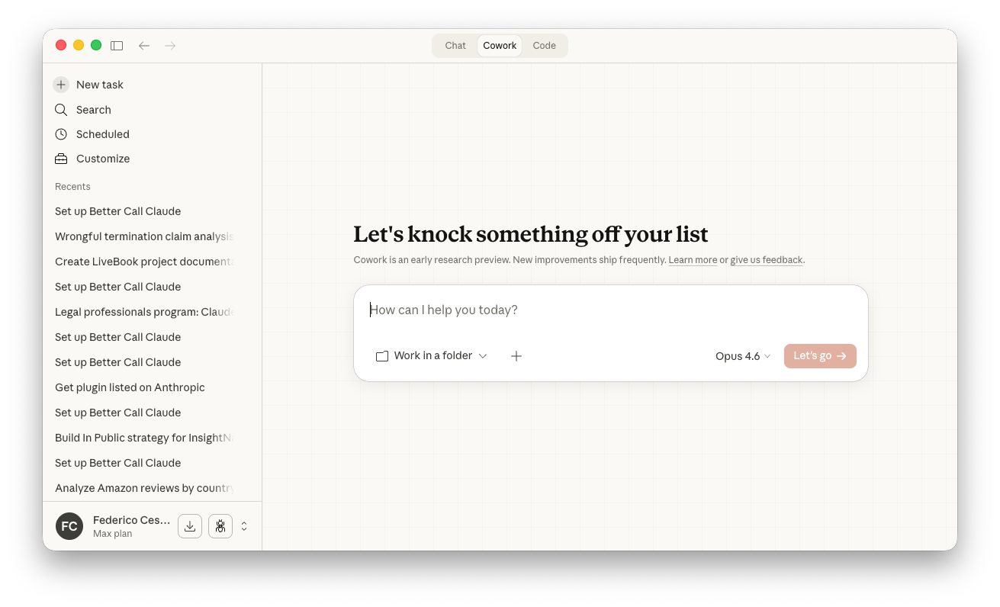
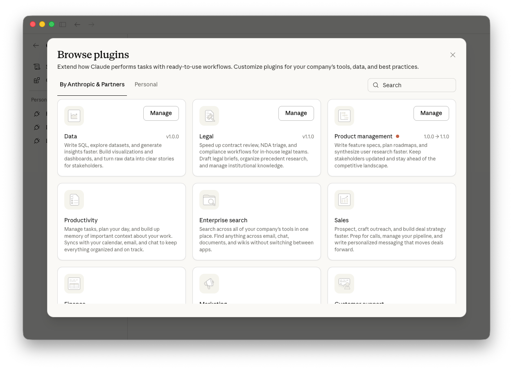
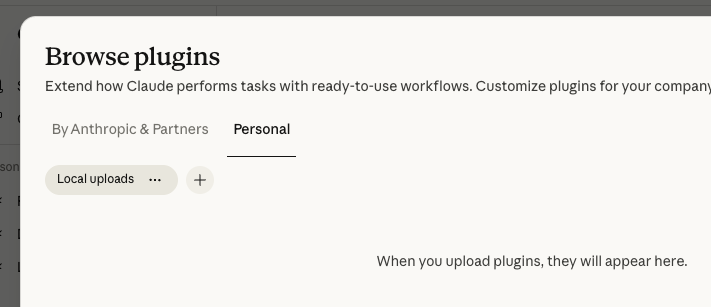
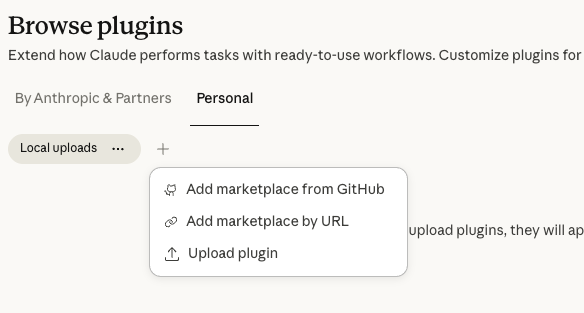
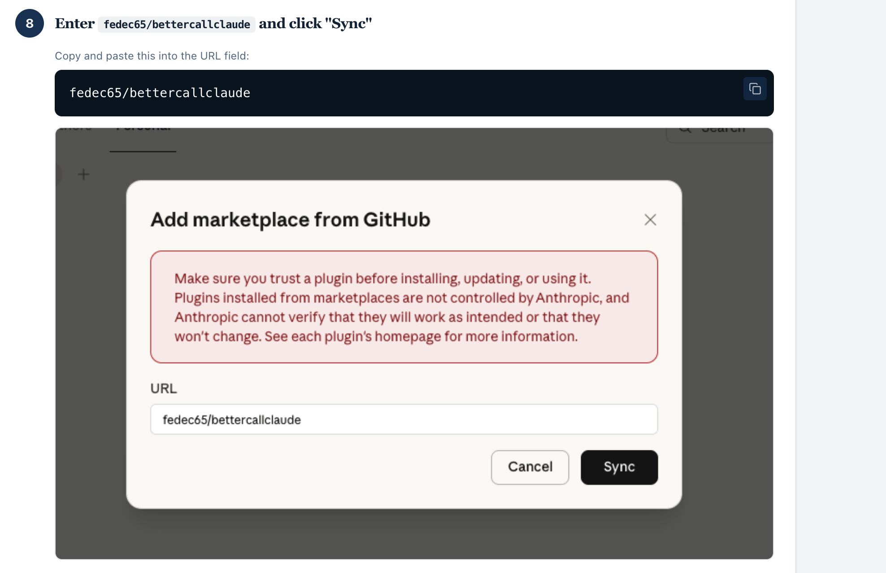
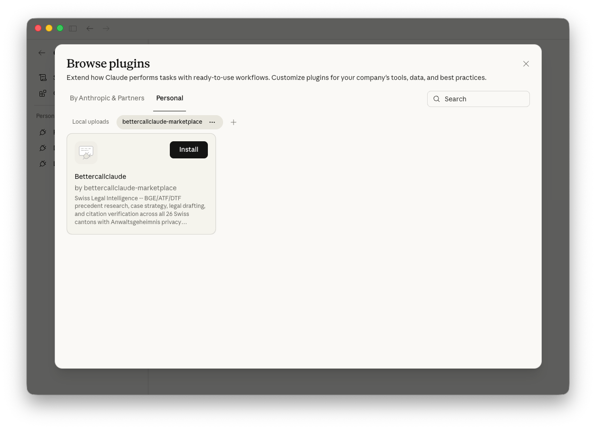
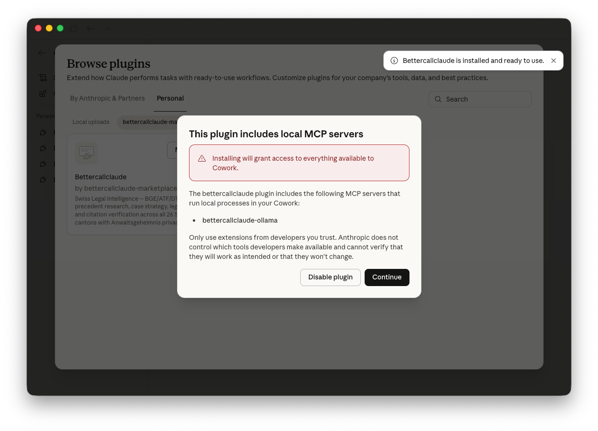
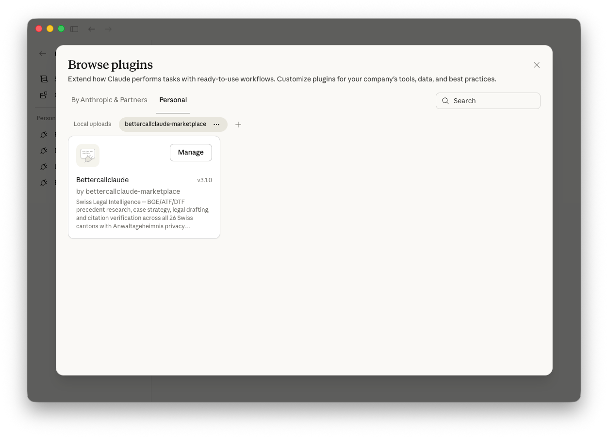
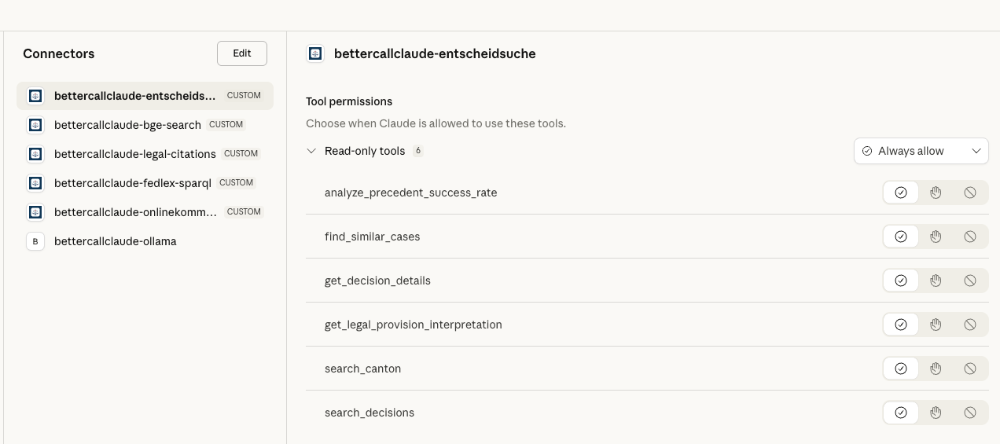

# Part 1: Quick Start

> **Get your first success in 15 minutes**

## What You'll Achieve

By the end of this section, you will be able to:

- Verify BetterCallClaude is working
- Look up your first BGE citation
 - Run your first legal research
 - Set up your workspace for a new matter

**⏱️ Estimated time: 15 minutes**

---

## 1.1 Prerequisites

Before you begin, ensure you have:

- ✅ A COWORK account with internet access
 - ✅ Basic familiarity with Swiss legal citations (BGE/ATf/DTF format)

---

## 1.2 Installation in COWORK

BetterCallClaude is installed through the Claude Desktop COWORK marketplace. Follow these steps carefully.

### Prerequisites

Before installing, ensure you have:
- ✅ Claude Desktop installed on your computer
- ✅ Internet connection active
- ✅ Network access enabled (see Step 1)

### Step 1: Enable Network Access

First, enable network permissions in Claude Desktop:

1. Open Claude Desktop
2. Go to **Settings** → **Capabilities**
3. Toggle **"Allow network egress"** to ON


*Enable network egress in Claude Desktop Settings*

### Step 2: Open COWORK

1. In Claude Desktop, click on **"Cowork"** in the left sidebar
2. This opens the COWORK workspace area


*Access the COWORK workspace*

### Step 3: Click Customize

1. In the left sidebar, click **"Customize"**
2. This opens the customization and plugins area


*Open the Customize panel*

### Step 4: Click Browse Plugins

1. Click **"Browse plugins"** to access the plugin marketplace


*Open the plugin browser*

### Step 5: Click Personal Tab

1. Click the **"Personal"** tab at the top
2. This section allows you to add custom plugin sources


*Switch to the Personal plugins tab*

### Step 6: Click the Plus (+) Button

1. Find the **+** button next to **"Local uploads"**
2. Click to reveal the dropdown menu


*Locate the add source button*

### Step 7: Select "Add Marketplace from GitHub"

1. From the dropdown, select **"Add marketplace from GitHub"**
2. A dialog box will appear


*Choose GitHub marketplace option*

### Step 8: Enter Repository and Sync

1. In the dialog, enter: `fedec65/bettercallclaude`
2. Click **"Sync"** to fetch the plugin


*Enter the BetterCallClaude repository*

### Step 9: Click BetterCallClaude and Install

1. Click on **BetterCallClaude** in the list
2. Click **"Install"** to begin installation


*Install BetterCallClaude*

### Step 10: Grant MCP Server Permissions

1. A permissions dialog will appear for MCP servers
2. Click **"Continue"** to grant the necessary permissions


*Grant MCP server permissions*

### Step 11: Installation Complete

1. You'll see a confirmation that installation is complete
2. Click **"Manage"** to configure your plugin


*Installation successful - click Manage to configure*

### Step 12: Click Connectors

1. Click **"Connectors"** to view the MCP servers
2. These are your data pipelines to Swiss legal databases


*Access the Connectors panel*

### Step 13: Verify 6 Connectors Available

You should see **6 connectors** listed:

| Connector | Purpose |
|-----------|---------|
| `entscheidsuche` | Court decisions search |
| `bge-search` | Federal Supreme Court (BGE) lookup |
| `legal-citations` | Citation validation & formatting |
| `fedlex-sparql` | Federal legislation database |
| `onlinekommentar` | Legal commentaries |
| `ollama` | Local AI for privacy-sensitive work |


*Verify all 6 connectors are present*

### Step 14: Set Each Connector to Always On

For each connector, set to **"Always on"**:

1. Click on each connector
2. Set the permission to **"Always on"**
3. Repeat for all 6 connectors


*Set each connector to "Always on"*

### Step 15: Ollama (Optional)

If you have Ollama installed on your computer, the Ollama MCP is connected automatically. This allows you to use local AI models for privacy-sensitive legal work.


*Ollama MCP connects automatically if installed*

---

### Post-Installation Setup

**Restart Claude Desktop** to clean the cache and ensure a fresh start.

After installing, run the setup command in COWORK to configure MCP servers:

```
/bettercallclaude:setup
```

This command will:
- Verify all MCP servers are connected
- Configure default settings
- Display your available capabilities

### Verification

To confirm everything is working, try typing:

```
Hello, are you available?
```

You should receive a response confirming BetterCallClaude is active and ready.

---

> ⚠️ **Installation issues? Check:**
> - Network egress is enabled (Step 1)
> - Repository name is exactly `fedec65/bettercallclaude`
> - All 6 connectors show in the list
> - Each connector is set to "Always allow"

---

## 1.3 Your First Citation Lookup

 Let's verify BetterCallClaude is working by looking up a real Swiss Federal Supreme Court decision.

### What to Type

 In COWORK, simply type:```
/bettercallclaude:cite BGE 147 IV 73
```### What You'll See

 BetterCallClaude will return:

```📄 **BGE 147 IV 73**

**Court**: Federal Supreme Court
 Switzerland
**Chamber**: IV (Criminal Law)
**Date**: 2021
 **Language**: German

**Summary**: [Brief summary of the case]

**Full Text**: [Link to full decision]
```

### Why This Matters

 This 10-second task would take 10+ minutes manually if you had to:
 - Navigate to the Federal Supreme Court website
 - Search for the specific citation
 - Find the correct language version
 - Locate the relevant passage

 BetterCallClaude does all of this instantly, accessing multiple databases simultaneously.

---

> ⚠️ **No results? Try this:**
> - Check your citation format: Use `BGE 147 IV 73`, not "147 IV 73"
 (without BGE)
 or "BGE147IV73" (no spaces)
 - Try German terms if English doesn't work: "Bundesgericht" instead of "Federal Court"
 - Use broader search terms, then narrow down
 - Verify the decision exists at entscheidsuche.ch if official sources fail

---

## 1.4 Your First Legal Research

 Now let's run a simple legal research query.### What to Type

```
/bettercallclaude:research Art. 97 OR contractual liability limitation period```### What You'll See

 BetterCallClaude will search across:
 - 📚 BGE/ATF/DTF decisions (Federal Supreme Court)
 - 📋 Cantonal court decisions
 - 📖 Legal commentaries (OnlineKommentar.ch)
 - 📄 Statutory provisions (Fedlex)

### Understanding the Response

 The response typically includes:

1. **Relevant Precedents**: Key cases that interpret Art. 97 OR
2. **Statutory Analysis**: The text of Article 97 itself
3. **Related Provisions**: Other relevant articles
4. **Practical Guidance**: How courts apply the law

### Key Takeaway

 **AI does the heavy lifting, you validate.** You always have final responsibility to verify citations and assess relevance.

---

## 1.5 Setting Up Your Workspace in COWORK

### Why a Dedicated Directory Matters

 Working in a dedicated directory per matter provides:

- **🧠 Context Persistence**: BetterCallClaude "remembers" your case across sessions
 - **📁 Organization**: All related files in one place
 - **🔄 Resume**: Pick up where you left off days or weeks later
### How to Create a Case/Matter Directory

 In COWORK, create a new folder for your matter:```
📁 2024-001_Smith_v_AG/  (Year-Number_ClientName_ContractType)    ├── 📄 CLAUDE.md          # Your persistent case memory    ├── 📄 contracts/        # Related documents    ├── 📄 correspondence/  # Emails, letters    ├── 📄 research/        # Research notes    └── 📄 drafts/         # Working drafts```### The CLAUDE.md File: Your Persistent Case Memory

 The `CLAUDE.md` file is the most important part of your workspace. BetterCallClaude reads this file at the start of every conversation to understand your case context.### What to Put in CLAUDE.md

 ```markdown
# Case: Smith v. AG

## Client
- **Name**: John Smith
- **Type**: Individual
- **Contact**: john.smith@email.com

## Opposing Party
- **Name**: AG Corporation
- **Type**: AG (Swiss corporation)
- **Industry**: Manufacturing

## Matter Summary
Contract dispute arising from commercial lease agreement dated 15 March 2023. Client claims AG violated exclusivity clause by soliciting competitor quotes.

## Key Facts
1. 5-year commercial lease signed 15.03.2023
2. Exclusivity clause: 2km radius, retail products only
3. AG approached competitor (Müller GmbH) for quote in September 2024
4. Client discovered competitor quote in October 2024
5. No written termination yet

## Legal Issues
- Contractual liability (Art. 97 OR)
- Damages calculation (Art. 99 OR)
- Potential injunctive relief
- Jurisdiction: Zurich Commercial Court

## Key Documents
- Commercial lease agreement (15.03.2023)
- Correspondence with AG (various dates)
- Competitor quote from Müller GmbH (10.2024)
- Client's internal notes

## Status
- **Phase**: Initial assessment
- **Next Steps**: Legal opinion on breach and damages
- **Deadline**: Client meeting 20.01.2025
```

### Example: Minimal CLAUDE.md for Quick Start

 For your first matter, start simple:```markdown
# Matter: [Brief description]

## Parties
- **Plaintiff/Client**: [Name and role]
- **Defendant/Opposing Party**: [Name and role]

## Core Issue
[One or two sentences describing the legal question]

## Key Documents
- [List important documents with dates]

## Status
- **Phase**: [Current phase]
- **Next**: [What you're working on now]
```

---

> ⚠️ **Context Not persisting? Check:**
> - Are you in the correct directory? (Check your current working directory)
> - Does CLAUDE.md exist? (It should be in your matter folder)
> - Is CLAUDE.md properly formatted? (Use proper markdown headers)
> - Did you save after creating/editing? (BetterCallClaude reads it at conversation start)

---

## ✅ Quick Start Checklist

Before moving on, verify:

- [ ] BetterCallClaude is installed in COWORK
- [ ] I can run `/bettercallclaude:cite BGE 147 IV 73` successfully
- [ ] I understand the response structure
- [ ] I have a dedicated directory for my matter
- [ ] I have created a CLAUDE.md file with basic case information

---

**🎉 Congratulations! You're ready to understand your AI assistant better.**

**Next**: [Understanding Your AI Assistant](./understanding-ai.md) →
