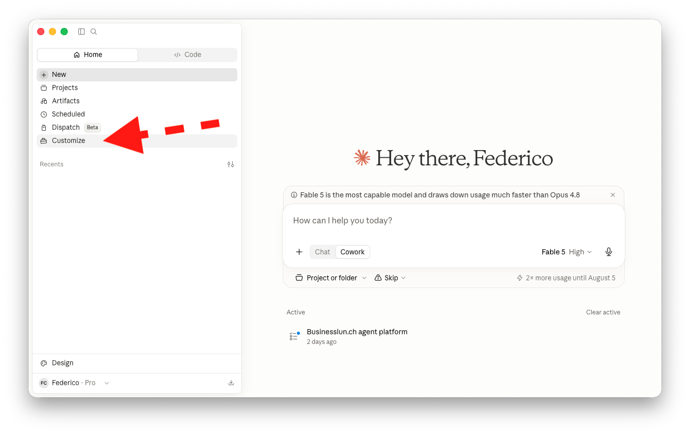
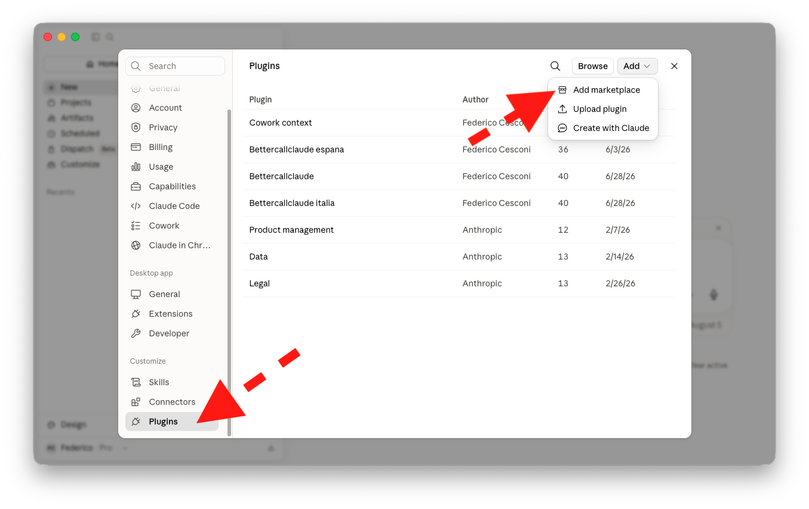
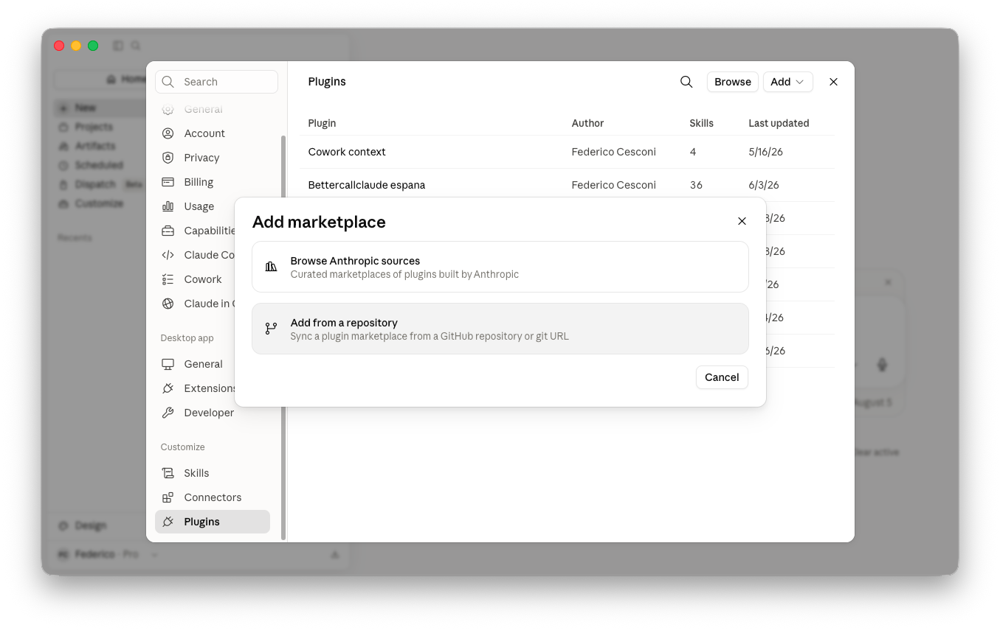
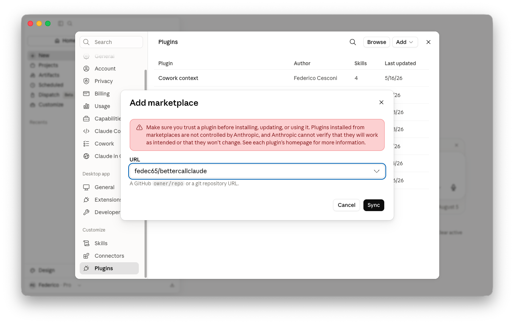
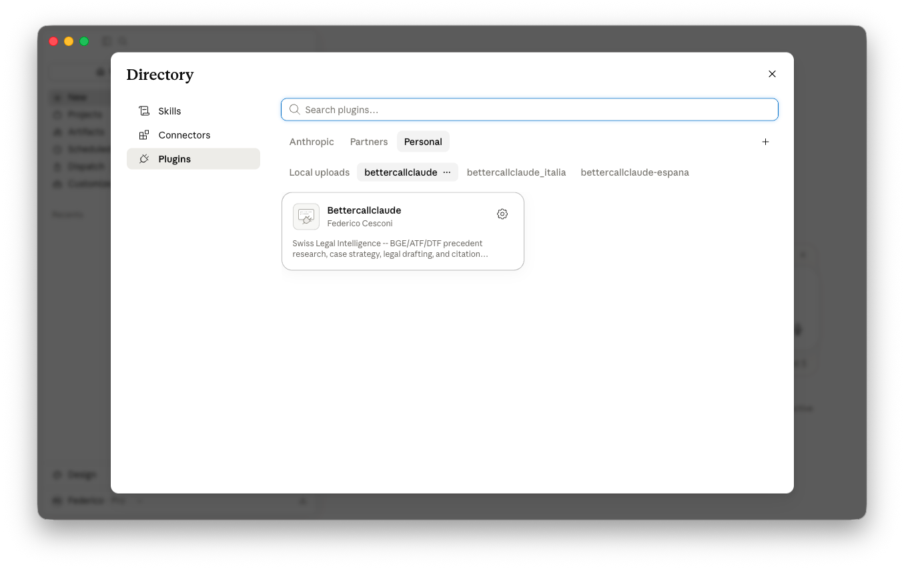
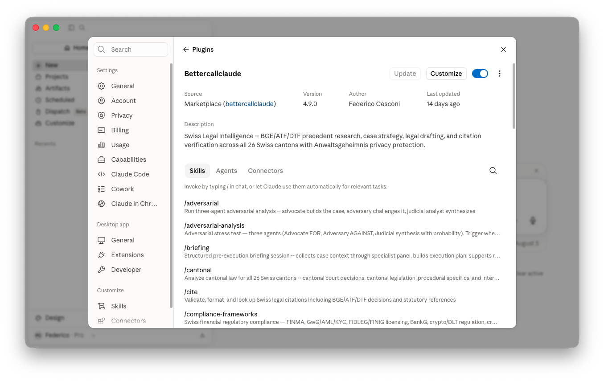
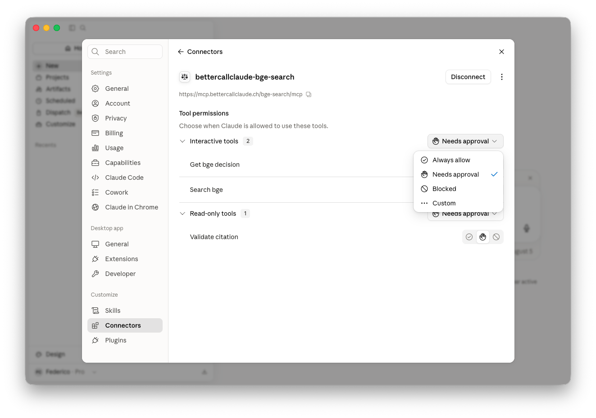

← [Back to Main Page](../README.md)

---

# Part 1: Quick Start

> **Get your first success in 15 minutes**

## What You'll Achieve

By the end of this section, you will be able to:

- Verify BetterCallClaude is working
- Look up your first BGE citation
 - Run your first legal research
 - Set up your workspace for a new matter

**⏱️ Estimated time: 15 minutes**

---

## 1.1 Prerequisites

Before you begin, ensure you have:

- ✅ A COWORK account with internet access
 - ✅ Basic familiarity with Swiss legal citations (BGE/ATf/DTF format)

---

## 1.2 Installation in COWORK

BetterCallClaude is installed through the Claude Desktop plugin marketplace in just a few steps.

### Prerequisites

Before installing, ensure you have:
- ✅ Claude Desktop installed on your computer
- ✅ An active internet connection

> 🌙 **A Note on Interface Changes**  
> Anthropic has a peculiar habit of redesigning the COWORK interface while the rest of us are sleeping. If these instructions don't match what you see on screen, don't worry—you're not going crazy. The menu items have simply taken a midnight stroll to new locations. We update this documentation as fast as humanly possible, but the UI may occasionally outpace us. When in doubt, look for buttons that sound similar to what we describe here.

### Step 1: Open Customize

1. Open Claude Desktop
2. In the left sidebar, click **Customize**


*Click Customize in the left sidebar*

### Step 2: Open Plugins and Add a Marketplace

1. In the Customize section, click **Plugins**
2. Click the **Add** button in the top-right corner
3. Select **Add marketplace**


*Open Plugins and select Add marketplace*

### Step 3: Select Add from a Repository

In the Add marketplace dialog, select **Add from a repository**.


*Choose Add from a repository*

### Step 4: Enter the Repository and Sync

1. In the URL field, enter: `fedec65/bettercallclaude`
2. Click **Sync**


*Enter the repository and click Sync*

### Step 5: Install BetterCallClaude and Open Settings

1. The Directory opens showing available plugins
2. Find the **Bettercallclaude** plugin card and click **Install**
3. Once installed, click the **gear wheel** icon on the plugin card


*Install the plugin, then click the gear wheel*

### Step 6: Confirm Installation

You should now see the BetterCallClaude plugin details page, confirming the plugin is installed.


*BetterCallClaude is installed*

### Step 7: Set Connector Permissions

1. In the plugin details page, click **Connectors** in the left sidebar
2. For each connector, set the permission to **Always allow**


*Set each connector to Always allow*

### Available Connectors Reference

You should see these **9 connectors**:

| Connector | Purpose |
|-----------|---------|
| `bettercallclaude-entscheidsuche` | Court decisions search |
| `bettercallclaude-bge-search` | Federal Supreme Court (BGE) lookup |
| `bettercallclaude-legal-citations` | Citation validation & formatting |
| `bettercallclaude-fedlex-sparql` | Federal legislation database |
| `bettercallclaude-onlinekommentar` | Legal commentaries |
| `legal-persona` | Swiss-law document intelligence (drafting, strategy, analysis) |
| `tas-jurisprudence` | CAS/TAS sports arbitration decisions |
| `swiss-caselaw` | Case law, citation graphs, appeal chains |
| `ollama` | Local AI for privacy-sensitive work |

### Ollama (Optional)

If you have Ollama installed on your computer, the Ollama MCP connects automatically. This allows you to use local AI models for privacy-sensitive legal work.

---

### Post-Installation Setup

**Close and reopen BetterCallClaude** — this empties the cache and ensures the new MCPs are loaded properly.

Then run the onboarding command in COWORK:

```
/bettercallclaude:start
```

`/start` (new in v4.8.1) is the non-technical entry point: it detects your preferred language, checks MCP connectivity for all 9 servers, walks you through creating a local playbook, and shows usage examples for your profile (law firm, in-house counsel, or fiduciary). The older `/bettercallclaude:setup` command still works as a deprecated alias.

**If something is not connecting**, run the diagnostics command:

```text
/bettercallclaude:doctor
```

`/doctor` tests each MCP server with a lightweight call and reports status, latency, and — in plain language — what the problem means for your work and how to fix it.

**Optional: Check your privacy mode**
```
/bettercallclaude:privacy
```
This shows your current privacy mode (`strict`, `balanced`, or `cloud`). Most users should keep the default `balanced` mode.

### Verification

To confirm everything is working, try typing:

```
Hello, are you available?
```

You should receive a response confirming BetterCallClaude is active and ready.

---

> ⚠️ **Installation issues? Check:**
> - Repository name is exactly `fedec65/bettercallclaude`
> - All 9 connectors show in the list
> - Each connector is set to "Always allow"

---

## 1.3 Your First Citation Lookup

 Let's verify BetterCallClaude is working by looking up a real Swiss Federal Supreme Court decision.

### What to Type

 In COWORK, simply type:```
/bettercallclaude:cite BGE 147 IV 73
```### What You'll See

 BetterCallClaude will return:

```

**Court**: Federal Supreme Court
 Switzerland
**Chamber**: IV (Criminal Law)
**Date**: 2021
 **Language**: German

**Summary**: [Brief summary of the case]

**Full Text**: [Link to full decision]
```

### Why This Matters

 This 10-second task would take 10+ minutes manually if you had to:
 - Navigate to the Federal Supreme Court website
 - Search for the specific citation
 - Find the correct language version
 - Locate the relevant passage

 BetterCallClaude does all of this instantly, accessing multiple databases simultaneously.

---

> ⚠️ **No results? Try this:**
> - Check your citation format: Use `BGE 147 IV 73`, not "147 IV 73"
 (without BGE)
 or "BGE147IV73" (no spaces)
 - Try German terms if English doesn't work: "Bundesgericht" instead of "Federal Court"
 - Use broader search terms, then narrow down
 - Verify the decision exists at entscheidsuche.ch if official sources fail

---

## 1.4 Your First Legal Research

 Now let's run a simple legal research query.### What to Type

```
/bettercallclaude:research Art. 97 OR contractual liability limitation period```### What You'll See

 BetterCallClaude will search across:
 - 📚 BGE/ATF/DTF decisions (Federal Supreme Court)
 - 📋 Cantonal court decisions
 - 📖 Legal commentaries (OnlineKommentar.ch)
 - 📄 Statutory provisions (Fedlex)

### Understanding the Response

 The response typically includes:

1. **Relevant Precedents**: Key cases that interpret Art. 97 OR
2. **Statutory Analysis**: The text of Article 97 itself
3. **Related Provisions**: Other relevant articles
4. **Practical Guidance**: How courts apply the law

### Key Takeaway

 **AI does the heavy lifting, you validate.** You always have final responsibility to verify citations and assess relevance.

---

## 1.5 Setting Up Your Workspace in COWORK

### Why a Dedicated Directory Matters

BetterCallClaude uses **context persistence** — it remembers your case across sessions. This only works when you work in a dedicated directory per matter.

**Benefits:**
- **🧠 Memory**: BetterCallClaude "remembers" your case context across sessions
- **📁 Organization**: All related files in one place
- **🔄 Resume**: Pick up where you left off days or weeks later without re-explaining

### How to Create a Case/Matter Directory

In COWORK, create a new folder for each matter:

```
📁 2024-001_Smith_v_AG/    (Year-Number_ClientName_MatterType)
    ├── 📄 CLAUDE.md          # ⚠️ CRITICAL: Must be in root of this folder
    ├── 📄 contracts/         # Related documents
    ├── 📄 correspondence/    # Emails, letters
    ├── 📄 research/          # Research notes
    └── 📄 drafts/            # Working drafts
```

---

### The CLAUDE.md File: Your Persistent Case Memory

#### What is CLAUDE.md?

`CLAUDE.md` is a **markdown file that BetterCallClaude automatically reads at the start of every conversation** in that directory. Think of it as your "case briefing document" that the AI reads before every interaction.

#### Why is it Important?

| Without CLAUDE.md | With CLAUDE.md |
|-------------------|----------------|
| You re-explain the case every session | AI already knows the context |
| Inconsistent advice across sessions | Coherent, building advice |
| Wasted time on background | Jump straight to substantive work |
| Risk of missing key details | All facts documented and referenced |

#### Why Must It Be in the Root Directory?

**Claude Code looks for `CLAUDE.md` in the root of your current working directory.** This is a built-in behavior:

1. When you open a folder in COWORK, that folder becomes your "working directory"
2. At the start of each conversation, Claude Code checks: *Is there a `CLAUDE.md` file here?*
3. If found → It reads the file and uses it as context
4. If not found → You start with no case context

**This means:**
- ✅ Put `CLAUDE.md` in the root of your matter folder
- ❌ Don't bury it in a subfolder (Claude won't find it)
- ❌ Don't name it differently (only `CLAUDE.md` is recognized)

---

### What to Put in CLAUDE.md

```markdown
# Case: Smith v. AG

## Client
- **Name**: John Smith
- **Type**: Individual
- **Contact**: john.smith@email.com

## Opposing Party
- **Name**: AG Corporation
- **Type**: AG (Swiss corporation)
- **Industry**: Manufacturing

## Matter Summary
Contract dispute arising from commercial lease agreement dated 15 March 2023. Client claims AG violated exclusivity clause by soliciting competitor quotes.

## Key Facts
1. 5-year commercial lease signed 15.03.2023
2. Exclusivity clause: 2km radius, retail products only
3. AG approached competitor (Müller GmbH) for quote in September 2024
4. Client discovered competitor quote in October 2024
5. No written termination yet

## Legal Issues
- Contractual liability (Art. 97 OR)
- Damages calculation (Art. 99 OR)
- Potential injunctive relief
- Jurisdiction: Zurich Commercial Court

## Key Documents
- Commercial lease agreement (15.03.2023)
- Correspondence with AG (various dates)
- Competitor quote from Müller GmbH (10.2024)
- Client's internal notes

## Status
- **Phase**: Initial assessment
- **Next Steps**: Legal opinion on breach and damages
- **Deadline**: Client meeting 20.01.2025
```

---

### Example: Minimal CLAUDE.md for Quick Start

For your first matter, start simple:

```markdown
# Matter: [Brief description]

## Parties
- **Plaintiff/Client**: [Name and role]
- **Defendant/Opposing Party**: [Name and role]

## Core Issue
[One or two sentences describing the legal question]

## Key Documents
- [List important documents with dates]

## Status
- **Phase**: [Current phase]
- **Next**: [What you're working on now]
```

---

### Why CLAUDE.md is Critical for Your Legal Practice

**CLAUDE.md is your persistent case memory.** Without it, every conversation with BetterCallClaude starts from zero — you must re-explain the parties, the facts, the legal issues, and the current status. With it, BetterCallClaude already understands your case context the moment you start a conversation.

**The one-case-one-directory rule:** Each legal matter deserves its own directory, and each directory must have its own `CLAUDE.md` file in the root. This is not optional — it's how BetterCallClaude knows which case you're working on.

```
📁 2024-001_Smith_v_AG/
    └── CLAUDE.md          ← BetterCallClaude reads THIS for this case

📁 2024-002_Mueller_v_GmbH/
    └── CLAUDE.md          ← BetterCallClaude reads THIS for this case
```

**When you open a directory in COWORK:**
- BetterCallClaude looks for `CLAUDE.md` in that directory's root
- It loads the file content as context before your first message
- All conversations in that directory benefit from that context

**If you forget CLAUDE.md:**
- BetterCallClaude has no memory of your case
- You waste time re-explaining background every session
- Advice may be inconsistent across conversations

---

### The Playbook: Your Firm's Standing Positions (v4.8.0)

Alongside `CLAUDE.md` (case memory), BetterCallClaude reads an optional **local playbook** — `bettercallclaude.local.md` — containing your firm's standing positions:

- Contractual positions (governing law, jurisdiction, liability caps)
- Risk thresholds and escalation rules
- Preferred citation format and output language

When a playbook exists, contract review classifies clauses against your standard positions (conforme / acceptable deviation / deviation to negotiate / unacceptable), drafting applies your preferences automatically, and NDA triage uses your thresholds. The plugin ships templates in DE, FR, IT, and EN; `/start` can create one with you through a short guided dialogue.

**Playbook search order:** `.claude/bettercallclaude.local.md` → shared folder → `.claude/legal.local.md` (Anthropic Legal plugin compatibility) → Swiss defaults. You can start without one — Swiss defaults apply.

---

### Where Your Deliverables Go (v4.8.1)

Since v4.8.1, long outputs are written as **files**, not chat walls. Every memo, research report, strategy, draft, or triage lands in a dated folder inside your matter directory:

```text
📁 2024-001_Smith_v_AG/
    ├── CLAUDE.md
    └── bcc-output/
        └── 2026-08-15-legal-opinion/
            ├── 01-research.md
            ├── 02-strategy.md
            ├── 03-draft.md
            └── sources.md     ← every source used, as a citation trail
```

The chat shows only a 3–5 line summary with a pointer to the files. This keeps deliverables versioned, citable, and ready to attach or archive — and the `sources.md` trail makes verification fast. The output folder is configurable in your playbook. (Case timelines are the exception: they live in `bcc-output/timeline/` as a living artifact, updated with `--merge`.)

---

> ⚠️ **Context Not persisting? Check:**
> - Are you in the correct directory? (Check your current working directory)
> - Does CLAUDE.md exist? (It should be in your matter folder)
> - Is CLAUDE.md properly formatted? (Use proper markdown headers)
> - Did you save after creating/editing? (BetterCallClaude reads it at conversation start)

---

## ✅ Quick Start Checklist

Before moving on, verify:

- [ ] BetterCallClaude is installed in COWORK
- [ ] `/bettercallclaude:start` completed and all 9 connectors are healthy
- [ ] I can run `/bettercallclaude:cite BGE 147 IV 73` successfully
- [ ] I understand the response structure
- [ ] I have a dedicated directory for my matter
- [ ] I have created a CLAUDE.md file with basic case information
- [ ] (Optional) I have a `bettercallclaude.local.md` playbook or know I can create one later

---

**🎉 Congratulations! You're ready to understand your AI assistant better.**

**Next**: [Understanding Your AI Assistant](./understanding-ai.md) →
