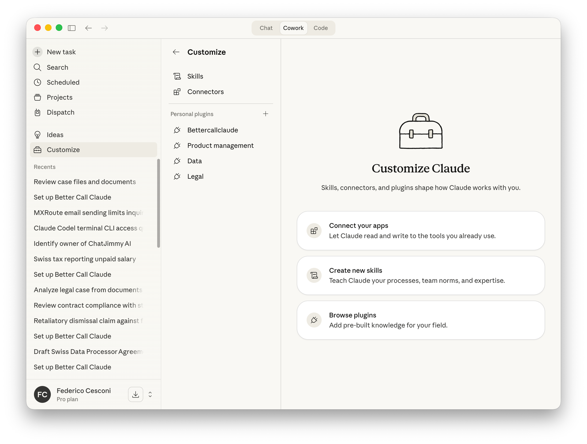
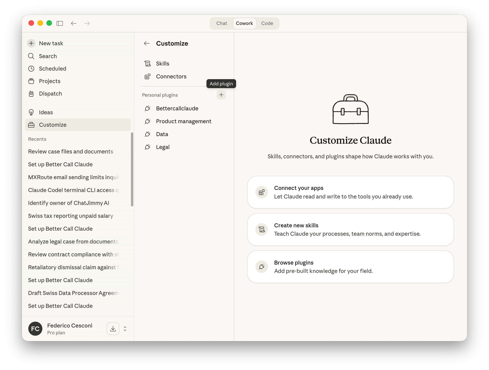
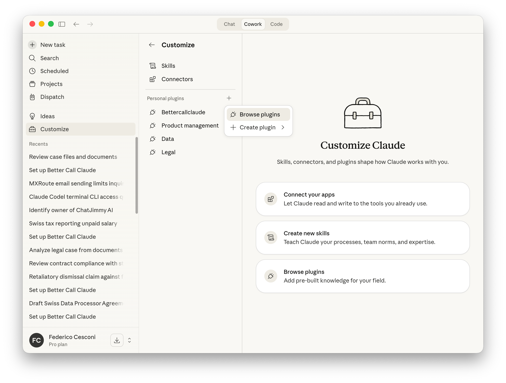
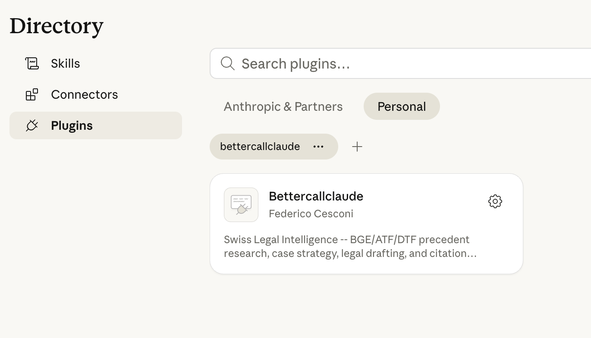
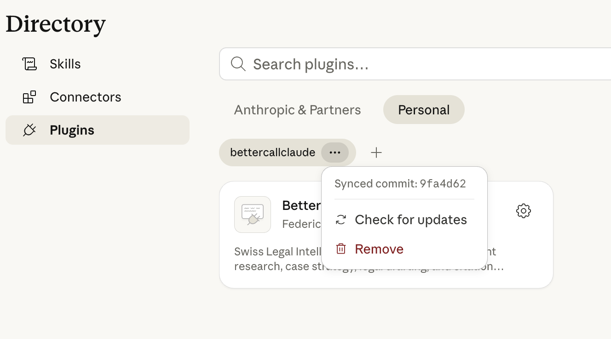
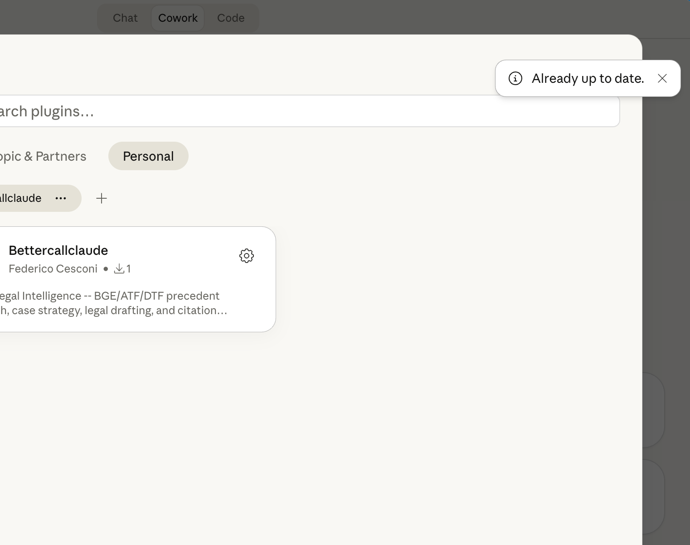

← [Back to Main Page](../README.md)

---

# Updating BetterCallClaude Plugin

> **Keep your plugin up to date with the latest features and improvements**

## Overview

BetterCallClaude is actively developed with new features, improved connectors, and bug fixes. This guide shows you how to check for updates and install them.

**⏱️ Estimated time: 2 minutes**

---

## When to Update

You should check for updates:
- **Monthly**: As part of regular maintenance
- **When announced**: Follow repository updates at `fedec65/bettercallclaude`
- **When experiencing issues**: Updates often fix known bugs
- **Before important matters**: Ensure you have the latest features

---

## Step-by-Step Update Process

### Step 1: Navigate to Customize

Click on **"Customize"** in the left sidebar to access the plugin management area.

*Open the Customize panel*

---

### Step 2: Open Plugin Options

Click the **"+"** icon next to **"Personal plugins"** to reveal plugin management options.

*Access plugin management menu*

---

### Step 3: Browse Plugins

Select **"Browse plugins"** from the dropdown menu to view your installed plugins.

*Open the plugin directory*

---

### Step 4: Access Plugin Menu

Find the **Bettercallclaude** plugin card and click the **three dots (⋯)** menu button on the right side.

*Open the plugin options menu*

---

### Step 5: Check for Updates

Click **"Check for updates"** from the dropdown menu. You'll see:
- The currently synced commit hash
- The update check option

*Select "Check for updates" from the menu*

---

### Step 6: Review Result

After clicking "Check for updates":

| Scenario | What Happens |
|----------|--------------|
| **Update available** | The plugin automatically updates to the latest version |
| **Already up to date** | You'll see a notification banner saying "Already up to date." |

*Confirmation that the plugin is up to date*

---

## Post-Update Steps

After updating, we recommend:

1. **Restart COWORK**: Close and reopen the COWORK workspace to ensure all changes take effect
2. **Verify connectors**: Check that all 6 MCP connectors are still enabled
3. **Run setup command**: Type `/bettercallclaude:setup` to verify everything is working
4. **Test a quick query**: Try a simple citation lookup to confirm functionality

---

## Troubleshooting Updates

### Issue: "Check for updates" is grayed out

**Solution**: Ensure you have an active internet connection and network egress is enabled in Claude Desktop settings.

### Issue: Update fails or stalls

**Solution**: 
1. Close Claude Desktop completely
2. Reopen and try again
3. If persists, remove and reinstall the plugin

### Issue: Connectors missing after update

**Solution**:
1. Go to the plugin settings (gear icon)
2. Click **Connectors** in the left sidebar
3. Ensure all 6 connectors are set to **"Always allow"**

---

## What's New?

To see what changed in the latest version:

1. Visit the repository at `https://github.com/fedec65/bettercallclaude`
2. Check the **Releases** section for changelogs
3. Review commit history for recent changes

---

## ✅ Update Checklist

- [ ] Opened Customize panel
- [ ] Clicked "Browse plugins"
- [ ] Found Bettercallclaude in the list
- [ ] Clicked three dots menu → "Check for updates"
- [ ] Confirmed update status (updated or already current)
- [ ] Restarted COWORK workspace
- [ ] Verified connectors are still enabled
- [ ] Ran `/bettercallclaude:setup` to verify

---

**🎉 Your BetterCallClaude plugin is now up to date!**

---

*Last updated: April 2026*
