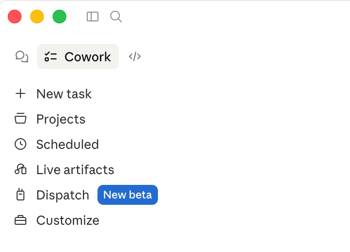
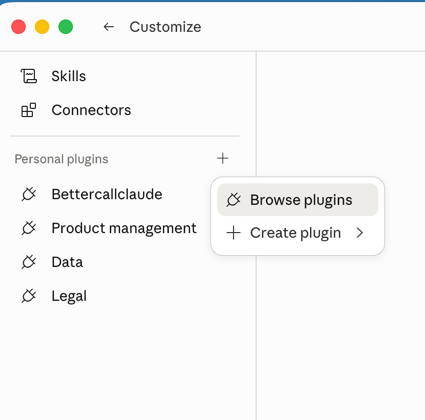
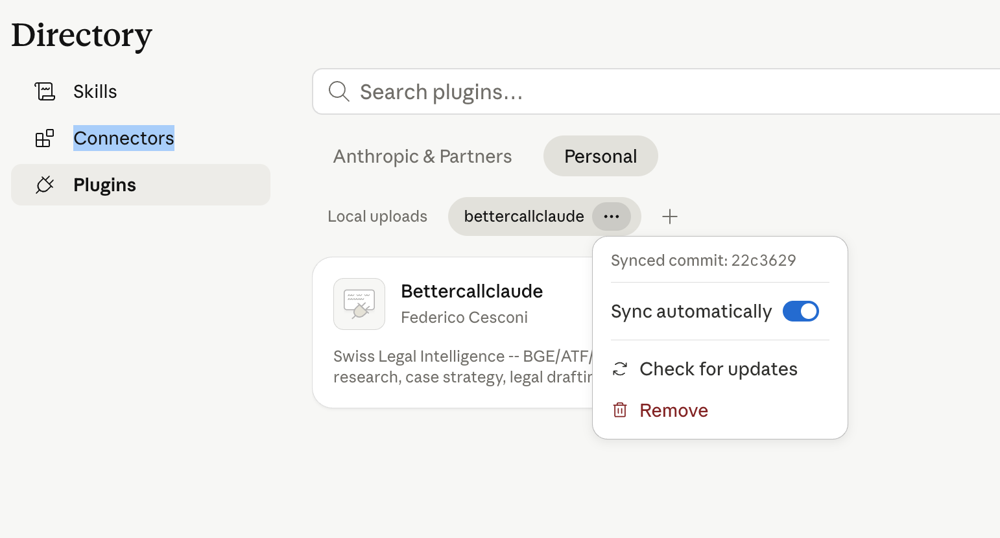
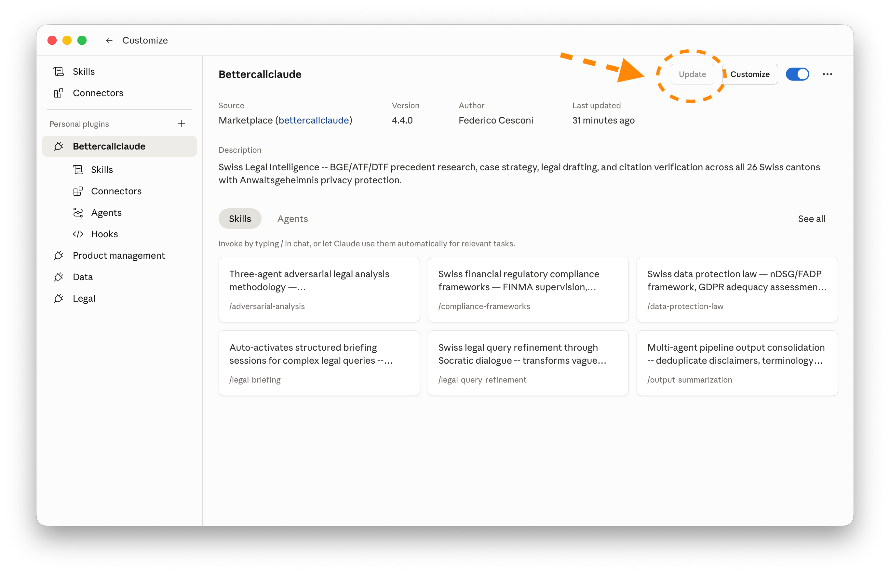

← [Back to Main Page](../README.md)

---

# Updating BetterCallClaude Plugin

> **Keep your plugin up to date with the latest features and improvements**

---

## How Cowork Plugin Updates Actually Work

Cowork's plugin system has **two independent layers**. Understanding the difference makes the update choice obvious.

---

## Layer 1 — The Marketplace Catalog

A **marketplace** is a Git repository whose `.claude-plugin/marketplace.json` lists which plugins exist and what version each is at. For you, the marketplace is `fedec65/bettercallclaude` itself.

Cowork keeps a **local cached copy** of that `marketplace.json`. Until that cache is refreshed, Cowork does not even know that a newer version exists.

### What refreshes the catalog?

| Action | What It Does | Result |
|--------|-------------|--------|
| **Manual Sync** (Sync button on the marketplace row) | Git-fetches the marketplace repo → re-reads `marketplace.json` → updates the local catalog | Installs **nothing**. Cheap, instant, safe. |
| **Auto-update marketplace** (toggle in the ⋯ menu) | Same as Manual Sync, but Cowork does it automatically — once on every app start, and periodically while running | Equivalent effect, just hands-off. |

> 💡 **Key insight**: Layer 1 only updates the *catalog*. It tells Cowork "version 4.4.0 exists." It does not download or install anything.

---

## Layer 2 — The Installed Plugin

Separately, for each plugin you have installed, Cowork tracks the **version you're actually running**. Your installed version does **not** change until you click **"Update plugin"** on that specific plugin.

The "Update plugin" button only becomes meaningful **after** the catalog has been refreshed to advertise a newer version (Layer 1).

### What "Update plugin" does

1. Downloads the plugin sub-directory at the version the catalog currently advertises
2. Validates it against Cowork's plugin validator
3. Swaps it in
4. Prompts for any new `userConfig` keys if the schema changed

> ⚠️ This is the **only** action that actually changes what code runs on your machine.

---

## What the Combinations Do

| Catalog Refresh | Plugin Update | Result |
|-----------------|---------------|--------|
| Manual sync | Manual click | You are in full control. Nothing changes unless you do **both** steps. Safest; recommended if you want to pin versions. |
| Auto-update marketplace | Manual click | Cowork silently knows about new versions, but won't install them. You get a visible "Update" indicator. **Sweet spot for most users** — zero friction on discovery, explicit consent on install. |
| Manual sync | *(no auto on the plugin — there is no "auto-update plugin")* | Same as above; just means you also have to remember to hit Sync. |
| Auto-update marketplace | Auto | **Not exposed in the UI.** Plugin installation is always an explicit click. |

---

## Recommended Settings for BetterCallClaude

### Turn ON "Sync automatically" for the marketplace

Since `fedec65/bettercallclaude` is your own plugin — you're the only publisher, and it has no third-party supply-chain risk — auto-sync is safe and convenient. You'll get a visible "Update" cue when a new release ships, without any manual Sync step.

### Leave "Update plugin" as manual

After each release, click **Update** once, answer any new `userConfig` prompt, and you're on the new version. This gives you a chance to:

1. **Read the CHANGELOG** first
2. **Test in a controlled moment** rather than mid-session

If a `userConfig` schema change happens mid-session, manual plugin update is your protection. Auto marketplace refresh is harmless — no code runs as a result of a catalog fetch.

---

## Step-by-Step: Enable Auto-Sync

### Step 1: Open Customize

In Cowork, click **"Customize"** in the left sidebar.

*Open the Customize panel*

---

### Step 2: Browse Plugins

Click the **+** next to **"Personal plugins"**, then select **"Browse plugins"**.

*Open the plugin browser*

---

### Step 3: Enable "Sync automatically"

1. Find the **Bettercallclaude** plugin card
2. Click the **three dots (⋯)** menu on the right
3. Toggle **"Sync automatically"** to **ON**

*Enable automatic marketplace catalog refresh*

**What this does:**
- Cowork will periodically fetch the latest `marketplace.json` from `fedec65/bettercallclaude`
- When a new version is published, Cowork will know about it automatically
- **Nothing is installed** — you just get an "Update" indicator

---

### Step 4: Update When Available

When a new version is available, go back to the plugin overview and click the **"Update"** button.

*Click Update to install the new version*

**What happens:**
- Cowork downloads and validates the new plugin version
- If the `userConfig` schema changed, you'll be prompted for any new settings
- The new version is swapped in immediately

---

## Post-Update Steps

After updating, we recommend:

1. **Restart COWORK**: Close and reopen the workspace to ensure all changes take effect
2. **Verify connectors**: Check that all 7 MCP connectors are still enabled
3. **Run setup command**: Type `/bettercallclaude:setup` to verify everything is working
4. **Test a quick query**: Try a simple citation lookup to confirm functionality

---

## Troubleshooting Updates

### Issue: "Update" button doesn't appear

**Cause**: The marketplace catalog hasn't been refreshed yet, so Cowork doesn't know a newer version exists.

**Solution**:
- If auto-sync is ON: wait a moment, or restart Cowork (it fetches on startup)
- If auto-sync is OFF: click the ⋯ menu → **"Check for updates"** to force a catalog refresh

### Issue: Update fails or stalls

**Solution**:
1. Close Claude Desktop completely
2. Reopen and try again
3. If it persists, remove and reinstall the plugin

### Issue: Connectors missing after update

**Solution**:
1. Go to the plugin settings (gear icon)
2. Click **Connectors** in the left sidebar
3. Ensure all 7 connectors are set to **"Always allow"**

---

## Edge Cases Worth Knowing

### Downgrades

If `marketplace.json` drops from 4.4.0 back to 4.3.0 (e.g., you revert a release), auto-sync will pick up the lower version on next fetch, and the "Update" button will offer the older version. Nothing warns you — verify the version number before clicking Update.

### Cache staleness on fresh install

If you install BetterCallClaude on a new machine and hit "Install", Cowork uses whatever its current cached `marketplace.json` says. On a fresh install this is freshly fetched, so you always get the latest version at install time.

### Zip uploads bypass the marketplace

If you ever install BetterCallClaude via a manual ZIP upload (e.g., for beta testing), the plugin is **pinned to that exact zip** regardless of what's in the marketplace. You'd have to uninstall and reinstall from the marketplace to rejoin the automatic update flow.

---

## ✅ Update Checklist

- [ ] Auto-sync is enabled on the `fedec65/bettercallclaude` marketplace
- [ ] I understand that auto-sync only refreshes the catalog — it does not install updates
- [ ] I will click "Update" manually when a new version is available
- [ ] After updating, I restart COWORK
- [ ] After updating, I verify all 7 connectors are enabled
- [ ] After updating, I run `/bettercallclaude:setup` to confirm connectivity

---

*Last updated: April 2026 — v4.3.0+
